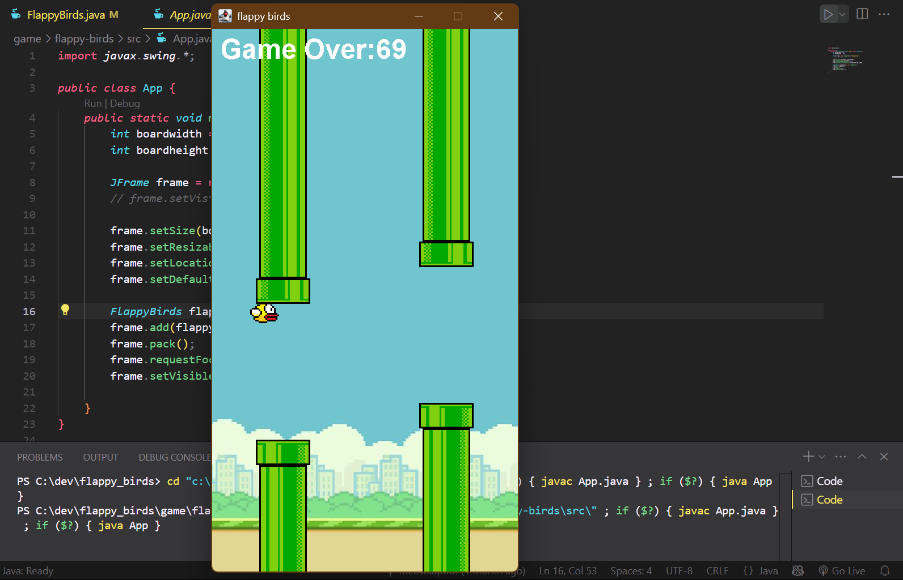

# 🐦 FlappyBird-Java

A classic Flappy Bird clone built entirely in **Java (Swing)**. Designed with expandability in mind — add new maps, birds, leaderboards, and more. Perfect for learning game development fundamentals in Java.

---

## 🚀 Features

- 🎮 Classic Flappy Bird gameplay
- 🏆 Personal Best score tracking
- 📊 Offline leaderboard support
- 🔊 Integrated sound effects

---

## 🧠 Planned Features

- 🌐 Online leaderboard using **Spring Boot REST API**
- 🔐 User login & authentication system
- 🗺️ Multiple map themes (day/night)
- 🐣 Unlockable birds skins and backgrounds
- 💀 Multiple difficulty modes (Easy, Normal, Hard)
- 🖼️ Dynamic UI themes

---

## 📸 Screenshots

| Gameplay |
|---------|
<<<<<<< HEAD
|  |
=======
|  |
>>>>>>> dc4691efb76ed60dd067d635c8c5d362f39acaff

---

## 🛠️ Requirements

- Java Development Kit (JDK) 17 or later
- Java IDE (IntelliJ IDEA, Eclipse, NetBeans, etc.)

---

## 🧪 How to Run

1. **Clone the repository:**
   ```bash
   git clone https://github.com/meowkapoor/flappy-birds.git
<<<<<<< HEAD
   cd flappy-birds
=======
   cd flappy-birds
>>>>>>> dc4691efb76ed60dd067d635c8c5d362f39acaff
